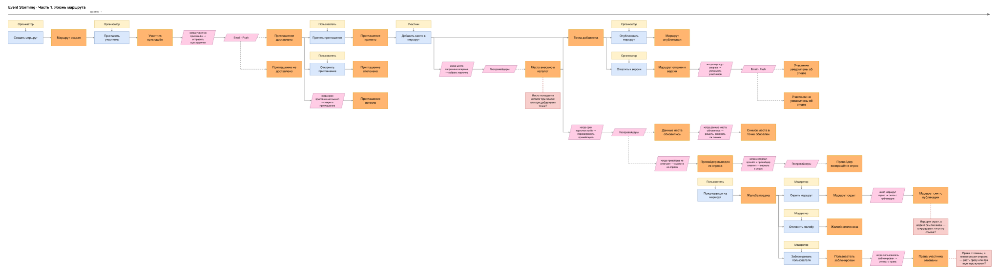
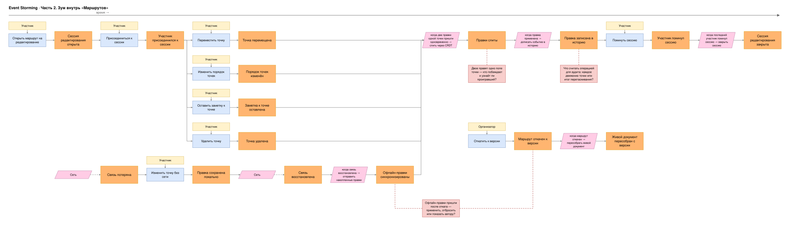

# Event Storming: границы через события

## Нотация

Цвета стикеров везде одни и те же:

| Цвет | Что это | Как формулирую |
|------|---------|----------------|
| 🟧 оранжевый | **доменное событие** — факт, который уже случился | прошедшее время: «Точка перемещена» |
| 🟦 синий | **команда** — намерение что-то сделать | повелительное: «Переместить точку» |
| 🟨 жёлтый | **актор** — кто отдаёт команду | роль, а не человек: «Организатор», «Модератор» |
| 🟪 розовый параллелограмм | **политика** или **внешняя система** | «когда произошло X → сделать Y»; геопровайдер, Email / Push |
| 🟥 красный | **hotspot** — спорное место, где надо договориться | вопрос, а не утверждение |

## Шаг 1. Доска

Доска состоит из двух частей. Сначала жизнь маршрута целиком, потом зум внутрь «Маршрутов» — core-поддомена, где живут сессия, офлайн и откат. Время везде идёт слева направо.

### Часть 1. Жизнь маршрута

От создания маршрута до модерации: что происходит с маршрутом, пока его собирают, публикуют, на него жалуются и откатывают. Доска читается слева направо одной линией, стрелки показывают причинность: «Создать маршрут → Маршрут создан → Пригласить участника → Участник приглашён → …». Актор стоит над своей командой. Основная линия — счастливый путь, развилки уходят на дорожки ниже.

Акторы — роли, а не люди. Один и тот же человек по ходу ленты переходит из роли в роль:

- **Гость** — ещё не зарегистрирован. На доске его нет: регистрация и вход живут у внешнего IdP, наш процесс на них не реагирует и начинается уже с авторизованного пользователя.
- **Пользователь** — авторизован, но в конкретном маршруте пока никто: просматривает, принимает приглашение, жалуется на публичный маршрут.
- **Организатор** и **Участник** — роли внутри конкретного маршрута. Участник правит маршрут. Организатор — участник с дополнительными правами: он же создаёт маршрут, приглашает, публикует и откатывает к прошлой версии. Роль появляется, когда пользователь создал маршрут или принял приглашение, — в другом маршруте тот же человек снова просто пользователь.
- **Модератор** — отдельная роль платформы, не связанная с маршрутами: разбирает жалобы, скрывает маршруты, блокирует нарушителей.

У многих событий актора нет — они случаются без человека. Их запускает розовая **политика** «когда произошло X → сделать Y». Если результат зависит от **внешней системы** — геопровайдеров или Email · Push, — она стоит между политикой и событием, а её ответ нарисован пунктиром. Политики связывают события без участия людей, поэтому почти каждая из них — кандидат на границу между контекстами.

Красный стикер — **hotspot**, вопрос, на который пока нет ответа; красный пунктир привязывает его к событию. На первой части доски их три:

- **Когда место попадает в каталог — при поиске или при добавлении точки?** У «Место внесено в каталог» политика реагирует не на событие, а на запрос: выбор места — это поиск, событий он не порождает, но каталог от него растёт. От ответа зависит, откуда «Маршруты» берут `placeId`: приходит ли он в команде готовым или «Маршруты» синхронно ждут Геокаталог.
- **Маршрут скрыт, а шаринг-ссылки живы — открывается ли он по ссылке?** «Маршрут скрыт» слышат «Маршруты» и снимают его с публикации, но шаринг-токены принадлежат «Доступу», и о скрытии он не знает.
- **Права отозваны, а живая сессия открыта — рвать сразу или при переподключении?** Realtime BFF проверяет права только при handshake, поэтому заблокированный участник может продолжать править, пока не переподключится.

**Развилки** — это несколько стрелок из одной точки. У доставки приглашения два исхода: Email · Push доставил или не доставил. После доставки их три: пользователь принял приглашение, отклонил его или не ответил, и тогда по сроку сработала политика. Добавление места ветвится: если место уже в каталоге, точка добавляется сразу, если нет — сначала карточку собирают у провайдеров. После добавления точки у организатора два пути: опубликовать маршрут или откатить его к прошлой версии; у уведомления об откате, как и у приглашения, есть недоставка. Для провайдера геоданных ответ «не отвечает» ведёт в отдельную цепочку: провайдер выводится из опроса и возвращается, когда снова отвечает.

**Жалоба — отдельная цепочка** без входящей стрелки: пожаловаться может любой пользователь в любой момент, пока маршрут опубликован. Дальше она расходится на три решения модератора: скрыть маршрут, отклонить жалобу, заблокировать пользователя.

.

draw.io: [`views/diagrams/event-storming-part-1.drawio.svg`](views/diagrams/event-storming-part-1.drawio.svg)

### Часть 2. Зум внутрь «Маршрутов»

Первая часть показала жизнь маршрута снаружи. Здесь — что происходит, пока маршрут правят вместе: живая сессия, слияние параллельных правок, запись в историю, офлайн и синхронизация, откат во время сессии. Читается так же, как первая часть: актор над командой, команда → событие → следующая команда. У событий без человека на месте команды — политика или внешняя система. Слияние правок, запись в историю, отправка накопленных офлайн-правок, пересборка живого документа после отката и закрытие сессии — это политики: они срабатывают сами, по предыдущему событию. Потерю и восстановление связи никто не выбирает — их приносит внешняя система «Сеть», её ответ нарисован пунктиром.

**Развилки и связи.** После того как участник присоединился к сессии, у него четыре вида правок: переместить точку, изменить порядок, оставить заметку, удалить точку. Все четыре сходятся в одну политику — слияние через CRDT, — а за ней в запись в историю: какой бы ни была правка, дальше она проходит одинаковый путь. Туда же, в слияние, приходят офлайн-правки после восстановления связи. **Офлайн — отдельная цепочка** без входящей стрелки: связь может пропасть в любой момент сессии, и её потерю приносит «Сеть», а не человек. **Откат — тоже отдельная цепочка**: организатор запускает его когда угодно, а политика пересобирает живой документ у всех, кто сейчас в сессии. Сессия заканчивается, когда её покидает последний участник.

Hotspot'ов здесь три, и каждый упирается в меру сценария из [дерева полезности](02-utility-tree.md) — пока на вопрос нет ответа, мера не проверяема:

- **Двое правят одно поле точки — кто побеждает и узнаёт ли проигравший?** CRDT сольёт правки без конфликта, но [S8](02-utility-tree.md) обещает авторезолв только для *неперекрывающихся* полей. Если оба двигают одну и ту же точку, одна правка молча проиграет.
- **Что считать операцией для аудита: каждое движение точки или итог перетаскивания?** [S7](02-utility-tree.md) требует «100% операций в логе ≤ 1 с». Перетаскивание — это десятки промежуточных движений в секунду; писать каждое — раздуть историю, писать итог — решить, где у правки конец.
- **Офлайн-правки пришли после отката — применить, отбросить или показать автору?** Участник правил без сети, а организатор тем временем откатил маршрут. [S5](02-utility-tree.md) обещает «потерь нет», [S6](02-utility-tree.md) — что состояние восстановлено к версии N. Оба обещания сразу не выполнить.

draw.io: [`views/diagrams/event-storming-part-2.drawio.svg`](views/diagrams/event-storming-part-2.drawio.svg).

### Что видно на доске

Пять вещей, которые были только словами или которые не были видны ранее.

**Политики легли на стрелки карты сервисов.** Почти каждая политика, которая связывает события без человека, соединяет два разных куска системы: «маршрут скрыт → снять с публикации» — Модерацию и Маршруты, «пользователь заблокирован → отозвать права» — Модерацию и Доступ, «участник приглашён → отправить приглашение» — Доступ и Уведомления, «маршрут откачен → уведомить участников» — Маршруты и Уведомления, «данные места обновились → решить, освежать ли снимок» — Геокаталог и Маршруты. Это ровно пунктирные стрелки-события на [карте сервисов](views/service-map.md). Там я их нарисовал из головы, здесь они проступили сами — из того, что событие случилось без актора.

**У supporting-контекстов есть своё поведение во времени.** В [service-boundaries](05-service-boundaries.md) Доступ и Геокаталог описаны данными: участники и роли, карточки и кеш. На доске у обоих нашлись политики с таймером, которые сами, без команды, меняют состояние: приглашение истекает по сроку, карточка места перезапрашивается, когда устарела, провайдер выводится из опроса и возвращается обратно. Это уже не хранилища, а участники процесса.

**Развилки.** У доставки приглашения два исхода, у ответа на приглашение — три, у жалобы — три решения модератора, у уведомления об откате — недоставка. Список возможностей развилок не показывает вовсе: «управление доступом» звучит как одна прямая линия. А развилки — это как раз те места, где процесс может закончиться не так, как задумано, и где нужны свои правила.

**Всё сходится в слияние и запись в историю.** Во второй части четыре вида правок онлайн и офлайн-правки после реконнекта приходят в одну политику слияния через CRDT, а за ней — в запись в историю. Это ядро «Маршрутов»: какой бы ни была правка и откуда бы она ни пришла, дальше путь один. Вокруг него живая сессия — открыть, присоединиться, покинуть, закрыть — и офлайн говорят на своём языке: сессия, участник онлайн, офлайн-очередь, живой документ. Отдельный ли это контекст, разбираю в [шаге 2](#шаг-2-bounded-context).

**Шесть hotspot'ов.** Все про случаи, которые я до доски не рассматривал. Они делятся на две группы.

- *Три — на границах между сервисами.* Когда место попадает в каталог и откуда «Маршруты» берут `placeId`; открывается ли по шаринг-ссылке скрытый маршрут, если скрытие слышат «Маршруты», а ссылки принадлежат «Доступу»; что делать с живой сессией, если права уже отозваны, а [Realtime BFF](views/c4-container.md) проверяет их только при handshake. Каждый из них — дыра в контракте, которую не видно ни на карте сервисов, ни на C4.
- *Три — внутри сессии, и каждый делает непроверяемой меру из [дерева полезности](02-utility-tree.md):* кто побеждает, когда двое правят одно поле (S8), что считать операцией для аудита (S7), что делать с офлайн-правками после отката (S5 против S6).

## Шаг 2. Bounded Context

<!-- Кластеры событий. У каждого контекста: события, язык (2–3 термина), чем владеет. -->

### Один термин — разные модели

## Шаг 3. Context Map

Связи между контекстами и их типы вынесены отдельно: [`views/context-map.md`](views/context-map.md).

## Шаг 4. Сверка с ДЗ-3

<!-- Таблица «сервис из ДЗ-3 → контекст из ДЗ-4 → итог», разбор расхождений, вывод. -->

### Вывод
