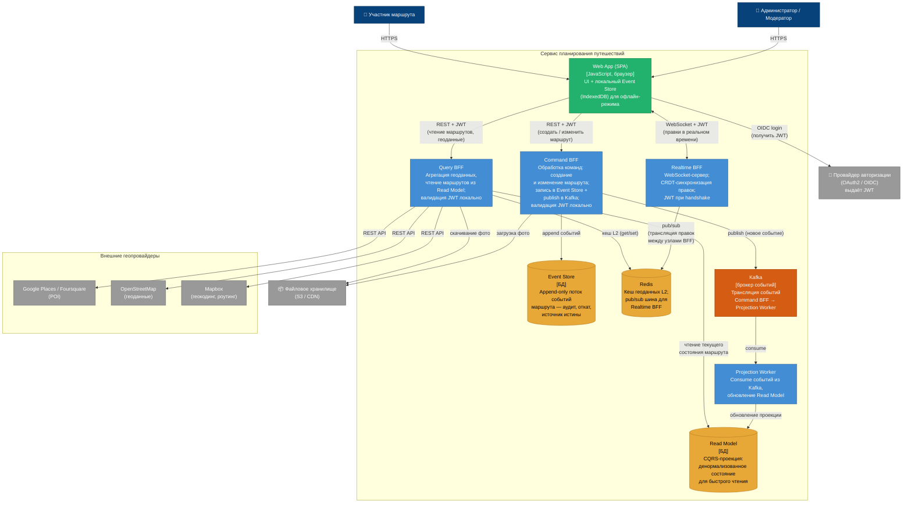

# C4, уровень 2 — Containers

У системы одно клиентское приложение, три приложения BFF, один Projection Worker, два хранилища данных, один кеш и один брокер событий.

## Диаграмма

## Контейнеры и откуда их требования

**Web App (SPA)** — клиентское приложение в браузере. Разворачивается на CDN, не содержит серверной логики. Внутри SPA — локальный Event Store на IndexedDB для офлайн-режима (D2, S5): без сети правки копятся локально, при восстановлении соединения уходят на Command BFF. Один UI и для участников, и для модераторов (разные права в JWT / claims).

**Command BFF** — «пишущий» BFF. Принимает команды (создать маршрут, добавить точку, откатить версию, заблокировать пользователя — для модератора), пишет событие в Event Store и публикует его в Kafka. Сам Read Model не обновляет — это делает Projection Worker. Разделение Command/Query — CQRS (D3, D4; [trade-offs.md](../trade-offs.md), [ADR-0001](../adr/0001-event-sourcing-cqrs.md)). Загружает фотографии в файловое хранилище.

**Projection Worker** — отдельный сервис-подписчик. Читает события из Kafka и обновляет Read Model. В IDP и к пользователям не ходит — у него нет пользовательских запросов. Вынесен из Command BFF, чтобы запись и построение проекции масштабировались независимо. Отставание проекции ≤ 2 с допустимо.

**Query BFF** — «читающий» BFF. Параллельно опрашивает гео-провайдеров (Google Places, OpenStreetMap, Mapbox), нормализует форматы, обогащает маршрут и отдаёт единый ответ. Геоданные кешируются в Redis (L2). При отказе провайдера — отвечает из кеша с пометкой «устаревшие данные» (circuit breaker, D1, S1 и S4). Отдаёт фотографии из файлового хранилища.

**Realtime BFF** — держит WebSocket-соединения. Правки транслируются через Redis pub/sub между узлами (D4, S2, S3).

**Event Store** — источник истины. Append-only: события только добавляются. Откат — новое событие в логе. Снапшоты ускоряют восстановление (D3, S6 и S7).

**Read Model** — CQRS-проекция текущего состояния маршрута. Обновляется Projection Worker'ом из Kafka; Query BFF читает отсюда. Отставание ≤ 2 с допустимо; выгода — загрузка ≤ 500 мс без replay истории (S1).

**Redis** — кеш геоданных L2 для Query BFF и pub/sub для Realtime BFF.

**Kafka** — шина: Command BFF публикует, Projection Worker потребляет.

**Провайдер авторизации (OAuth2 / OIDC)** — выдаёт JWT при логине. На схеме с BFF **не** ходит на каждый запрос: BFF валидируют JWT сами. Редко (не нарисовано) BFF обновляют JWKS с IDP при ротации ключей.

**Файловое хранилище (S3/CDN)** — фото точек маршрута. Query читает, Command пишет.

## Что не нарисовано и почему

- **Circuit breaker и ACL-адаптеры к провайдерам** — компоненты внутри Query BFF.
- **CRDT-движок (Yjs / Automerge)** — библиотека внутри Realtime BFF и SPA.
- **Снапшот-сервис** — фоновый поток внутри Command BFF.
- **Transactional Outbox** — деталь dual write (Event Store + Kafka) внутри Command BFF.
- **L1 in-memory кеш** — внутри Query BFF.
- **Валидация JWT / JWKS-клиент** — middleware внутри каждого BFF; редкий fetch JWKS с IDP не рисуем как постоянную связь.
- **Сервис загрузки файлов** — логика внутри Command / Query BFF.
- **Админ-панель модератора** — тот же SPA с другими claims в JWT.
