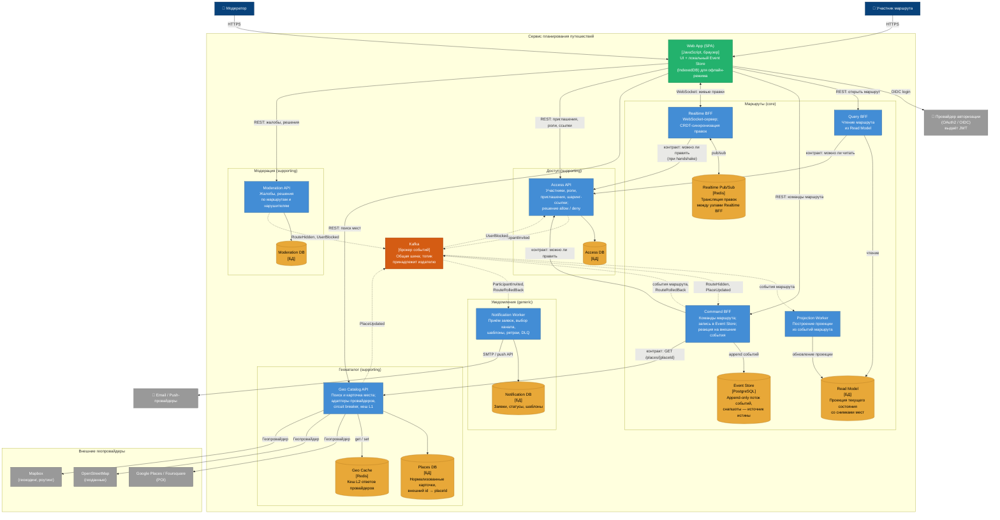

# C4, уровень 2 — Containers

Контейнерный вид сведён с [картой сервисов](service-map.md): каждый сервис из [`05-service-boundaries.md`](../05-service-boundaries.md) — отдельная рамка со своими деплой-единицами и своими хранилищами. Общих баз между сервисами нет; общая только шина событий.

## Диаграмма

Сплошная стрелка — синхронный вызов, пунктирная — асинхронное событие через Kafka. Обозначения те же, что на [карте сервисов](service-map.md).

## Контейнеры по сервисам

| Сервис | Контейнеры | Хранилища |
|---|---|---|
| Маршруты (core) | Command BFF, Query BFF, Realtime BFF, Projection Worker | Event Store, Read Model, Realtime Pub/Sub |
| Геокаталог | Geo Catalog API | Places DB, Geo Cache |
| Доступ | Access API | Access DB |
| Модерация | Moderation API | Moderation DB |
| Уведомления | Notification Worker | Notification DB |
| Авторизация | — (внешний IdP) | — |

Ни одно хранилище не встречается в двух строках — это та же проверка, что и в [карте владения данными](../05-service-boundaries.md#карта-владения-данными).

**Web App (SPA)** — клиентское приложение в браузере. Разворачивается на CDN, не содержит серверной логики. Внутри SPA — локальный Event Store на IndexedDB для офлайн-режима (D2, S5): без сети правки копятся локально, при восстановлении соединения уходят на Command BFF. Один UI и для участников, и для модераторов (разные права в JWT / claims).

### Маршруты

Четыре контейнера одного вертикального среза: все обслуживают одну ответственность и меняются по одной причине ([06](../06-cohesion-coupling.md#1-маршруты)).

**Command BFF** — «пишущий» BFF. Принимает команды (создать маршрут, добавить точку, откатить версию), спрашивает у Доступа «можно ли править», пишет событие в Event Store и публикует его в Kafka. При добавлении точки получает карточку у Геокаталога по контракту `GET /places/{placeId}` и сохраняет снимок отображаемых полей в событии — в кеш Геокаталога не ходит ([Риск 2](../06-cohesion-coupling.md#риск-2-маршруты-сами-лезут-в-кеш-геокаталога)). Кроме того, слушает чужие события и переводит их в события маршрута: `RouteHidden` → маршрут снят с публикации, `PlaceUpdated` → решение, обновлять ли снимок. Разделение Command/Query — CQRS (D3, D4; [03-trade-offs.md](../03-trade-offs.md), [ADR-0001](../adr/0001-event-sourcing-cqrs.md)).

**Projection Worker** — подписчик на события маршрута. Обновляет Read Model; к пользователям и в IdP не ходит. Вынесен из Command BFF, чтобы запись и построение проекции масштабировались независимо. Отставание проекции ≤ 2 с допустимо (S10).

**Query BFF** — «читающий» BFF. Отдаёт маршрут из Read Model вместе со снимками мест, поэтому при открытии маршрута Геокаталог не дёргает (S1). Перед ответом спрашивает у Доступа «можно ли читать» — это же покрывает открытие по шаринг-ссылке.

**Realtime BFF** — держит WebSocket-соединения. Право на правку проверяет у Доступа при handshake. Правки транслируются через Redis pub/sub между узлами (D4, S2, S3).

**Event Store** — источник истины. Append-only: события только добавляются. Откат — новое событие в логе. Снапшоты ускоряют восстановление (D3, S6 и S7).

**Read Model** — CQRS-проекция текущего состояния маршрута. Обновляется Projection Worker'ом; Query BFF читает отсюда. Выгода — загрузка ≤ 500 мс без replay истории (S1).

**Realtime Pub/Sub** — Redis только для шины правок между узлами Realtime BFF. С кешем Геокаталога не делится.

### Геокаталог

**Geo Catalog API** — единственный контейнер, который знает провайдеров ([Риск 1](../06-cohesion-coupling.md#риск-1-каждый-сервис-сам-ходит-в-геопровайдеры)). Параллельно опрашивает Google Places, OpenStreetMap и Mapbox, нормализует ответы в карточку места за ≤ 500 мс (S9). При отказе провайдера отвечает из кеша с пометкой «данные могут быть устаревшими» (circuit breaker, D1, S4). Отдаёт поиск участнику в UI и карточку `GET /places/{placeId}` Маршрутам. Когда провайдер поправил данные, публикует `PlaceUpdated`.

**Places DB** — нормализованные карточки и соответствие внешнего id внутреннему `placeId`.

**Geo Cache** — Redis, кеш L2 ответов провайдеров с TTL под тип данных.

### Доступ

**Access API** — решает, кто какой маршрут видит и меняет: отвечает `allow | deny` на запросы трёх BFF Маршрутов, принимает от SPA команды «пригласить», «выдать роль», «выпустить ссылку». Приглашение не доставляет сам — публикует `ParticipantInvited`. Слушает `UserBlocked` и отзывает права заблокированного.

**Access DB** — участники, роли, приглашения, шаринг-токены.

### Модерация

**Moderation API** — принимает жалобы участников и решения модератора. Маршрут не редактирует и писем не шлёт: наружу уходят только события `RouteHidden` и `UserBlocked`, применяют их Маршруты и Доступ.

**Moderation DB** — решения, причины, блокировки.

### Уведомления

**Notification Worker** — без публичного API: заявки приходят событиями (`ParticipantInvited`, `RouteRolledBack`) вместе с получателем. Выбирает канал, подставляет шаблон, отправляет через внешних Email / Push-провайдеров, повторяет при сбоях, неудачи уводит в DLQ. Статусы доставки обратно никто не читает.

**Notification DB** — заявки, история статусов, шаблоны, маршрутизация «канал → провайдер».

### Общее

**Kafka** — общая шина платформы. Это инфраструктура, а не общая база: у каждого топика один издатель, схема события — его контракт. Подписчик не знает, как устроено хранилище издателя.

**Провайдер авторизации (OAuth2 / OIDC)** — выдаёт JWT при логине. Сервисы с IdP на каждый запрос **не** ходят: каждый контейнер с внешним API валидирует JWT сам. Своего контейнера у «Авторизации» нет — мы владеем только контрактом проверки JWT.

## Что не нарисовано и почему

- **Circuit breaker, ACL-адаптеры провайдеров, L1 in-memory кеш** — компоненты внутри Geo Catalog API.
- **CRDT-движок (Yjs / Automerge)** — библиотека внутри Realtime BFF и SPA.
- **Снапшот-сервис** — фоновый поток внутри Command BFF.
- **Transactional Outbox** — у каждого издателя (Command BFF, Geo Catalog API, Access API, Moderation API): запись в свою БД и публикация в Kafka без dual write.
- **Валидация JWT / JWKS-клиент** — middleware внутри каждого контейнера с внешним API; редкий fetch JWKS с IdP не рисуем как постоянную связь.
- **API Gateway / маршрутизация запросов SPA** — на этом уровне не принципиальна; SPA показан обращающимся к контейнерам напрямую.
- **Админ-панель модератора** — тот же SPA с другими claims в JWT.
