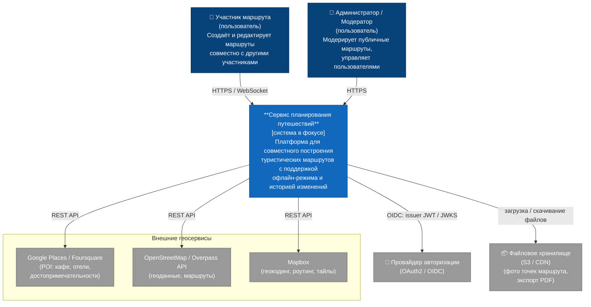

# C4, уровень 1 — System Context

Про что система, кто ею пользуется и с чем она интегрирована.

## Диаграмма

## Что здесь видно

В центре — сервис планирования путешествий: единственное, за что мы отвечаем.

**Участник маршрута** — главный тип пользователя на этом уровне.

**Администратор/Модератор** — «босс». Модерирует публичные маршруты (просмотр, скрытие, удаление), управляет пользователями (блокировка при нарушениях), просматривает историю изменений маршрутов для разрешения конфликтов. В документации не описывал такую роль, но на схеме решил отразить.

**Внешние геосервисы** — интеграции системы наружу для получения данных о местах, и у нас нет контроля над ними.

**Провайдер авторизации** — внешний OIDC-issuer: логин пользователя и выдача JWT. Система доверяет его ключам (JWKS); проверку подписи токена на каждом запросе делает сама (см. [Containers](c4-container.md)), а не дергает IDP.

**Файловое хранилище** — используется для хранения фотографий, прикреплённых к точкам маршрута, и генерации экспортов маршрута (PDF, изображения).

Как система устроена внутри — в [C4 Containers](c4-container.md).
