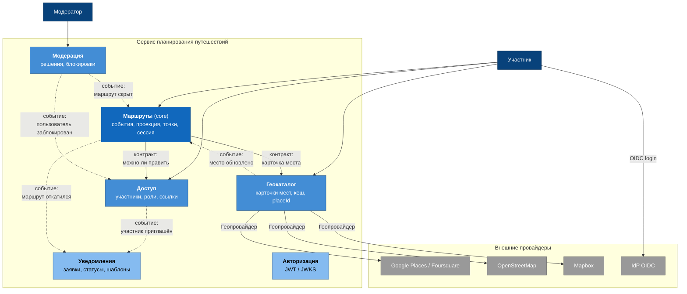

# Карта сервисов

Здесь всё, что разобрано в `[04-capabilities.md](../04-capabilities.md)`, `[05-service-boundaries.md](../05-service-boundaries.md)` и `[06-cohesion-coupling.md](../06-cohesion-coupling.md)`, сведено в одну картинку. Сервисы, чем каждый владеет и что передаётся по связям.

## Диаграмма

Сплошная стрелка — синхронный вызов по контракту, пунктирная — асинхронное событие. Цвет показывает тип поддомена: тёмно-синий core, светлее supporting, самый светлый generic.

Токен авторизации проверяет каждый сервис на входе, и если нарисовать все связи, получится пачка линий, которые перечеркнут схему и ничего не объяснят.